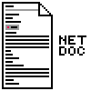

# Net-Doc

Highly Opinionatable Documentation for your network, scout group, or anything.

## More

[Read More](https://longridge-high-school.github.io/net-doc/) in the
documentation.

## Roadmap

The next version of Net-Doc is aiming to be `1.1`, these are the
[issuse being worked on](https://github.com/Longridge-High-School/net-doc/issues?q=is%3Aopen+is%3Aissue+milestone%3A%22Version+1.1%22).

The longer term goals are listed in the
[version next](https://github.com/Longridge-High-School/net-doc/issues?q=is%3Aopen+is%3Aissue+milestone%3A%22Version+Next%22)
milestone.

## Technology

Net-Doc incorperates quite a few open source technologies, some of which are
listed here:

- Remix
- Prisma
- React
